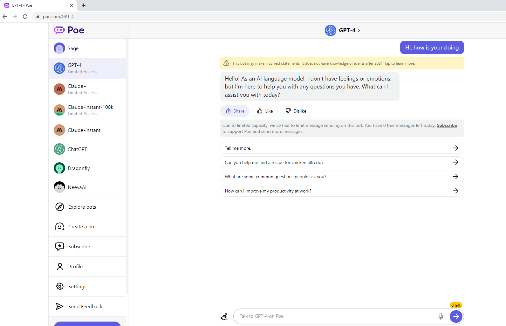

### 介绍
-------------------------
本项目是建立在poe.com提供的生成式对话服务基础之上的，免费使用gpt4的chrome插件工具。poe.com是quora提供的多模型的生成式对话网站，里面有ChatGPT,gpt4,claude等对话模型，其中ChatGPT和claude是免费使用的。但是gpt4一个账号一天只有一次的免费gpt4使用机会,所以如果我们如果要在poe.com上完成完整的对话不可行。



但是，如果我们有多个poe.com账号，就可以借助gpt基于上下文推测的机理来完成完整的对话。我们需要对于gpt4的预测原理进行了解，即gpt4在后台不会存储一个对话id，它仅依据提供给他的文本进行下一阶段的文字预测。比如，
```
User:
Hi, how is your doing?
ChatGPT:
fine, and you?
```
如果这时候User说`good. the weather is nice today`,如果认为我们仅仅向ChatGPT发送一句`good. the weather is nice today`的想法是错误的。它会将历史上的所有对话，即下面的全部内容，发送给ChatGPT。
```
User:
Hi, how is your doing?
ChatGPT:
fine, and you?
User:
good. the weather is nice today
```
然后ChatGPT会根据所有的文字进行预测并返回`yes, I hope it will not rain today`的结果。

明白了ChatGPT的原理，我们可以采用复制历史对话到下一个poe.com继续对话的方法来完成完整的对话过程。但是复制对话和调整样式是一个重复、枯燥、且容易出错的过程，本插件正好提供了简化这个过程的工具，仅需要一个鼠标点击就可以复制所有的历史对话到系统剪切板。


### 使用条件
- 批量的poe.com账号。poe.com账号是可以仅需要邮箱验证使用，自行解决批量邮箱问题，推荐outlook邮箱
- chrome浏览器，版本 113.0.5672.127（正式版本） （64 位）及以上
- 使用chrome的多账号功能，多账号功能是提供用户可以通过隔离环境在同一个chrome浏览器上访问相同网址而不会发生账号冲突的功能
- 在chrome上添加多个chrome账号，选择`在不登录的情况下继续`

### 使用步骤
- 安装插件，下载本项目，`chrome浏览器`->`设置`->`扩展程序`->`开发者模式`->`加载已解压的扩展程序`->`选择本项目`
- 进入poe.com，使用poe.com的gpt4服务
- 点击poe.com的左上角icon，网页提示复制成功。到下一个poe.com账号粘贴，继续使用gpt4对话

*修改chrome插件的内容，重新关闭打开浏览器更新会自动加载*
